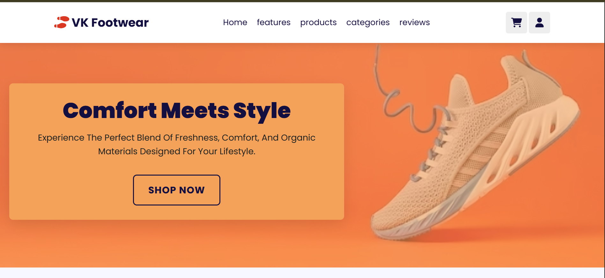
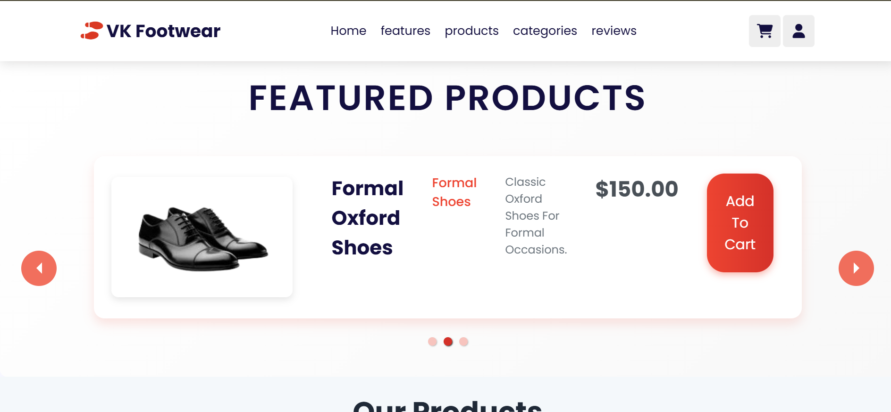
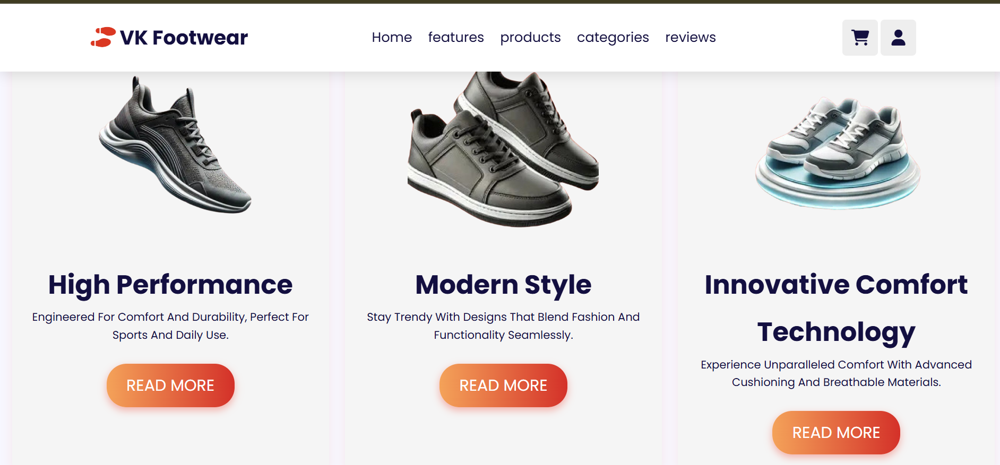

# Shoe Website

A responsive, single‑page e‑commerce frontend for **VK Footwear** built with React and Vite. Discover our curated collection of stylish, comfortable shoes—crafted for every step of your journey. Enjoy a seamless shopping experience with fast load times and a mobile‑first design.

---

## Table of Contents

1. [Demo](#demo)  
2. [About](#about)  
3. [Features](#features)  
4. [Tech Stack & Prerequisites](#tech-stack--prerequisites)  
5. [Getting Started](#getting-started)  
   - [Clone & Install](#clone--install)  
   - [Available Scripts](#available-scripts)  
6. [Project Structure](#project-structure)  
7. [Usage](#usage)  
8. [Contributing](#contributing)  
9. [License](#license)  
10. [Reviews](#reviews)  
11. [Author](#author)  

---

## Demo

  
  
 

---

## About

**VK Footwear** was founded with a simple mission: to bring comfort and style together for everyone. Inspired by the needs of everyday people, we focus on quality materials, modern designs, and a customer-first approach. Our journey began with a passion for shoes and a commitment to making every step count. Whether you’re heading to work, the gym, or a night out, VK Footwear has something for you.

---

## Features

1. **Modern, Responsive Design**  
   - Clean, mobile-first interface that looks great on any device.
2. **Curated Product Selection**  
   - Browse a handpicked range of shoes, each with detailed descriptions and high-quality images.
3. **Easy Shopping Cart**  
   - Effortlessly add, remove, and update items in your cart. Cart contents are saved even if you leave the site.
4. **Streamlined Checkout**  
   - Simple, secure checkout form for a hassle-free purchase experience.
5. **Customer-Focused Experience**  
   - Fast load times, intuitive navigation, and clear product information.
6. **Built for Growth**  
   - Modular codebase using React hooks and Context API, making it easy to add new features as we grow.

---

## Reviews

> “VK Footwear offers amazing comfort and style. My experience was fantastic from browsing to delivery!”  
> — *Pawan*

> “Great variety and quality. The website is easy to use and the shoes exceeded my expectations.”  
> — *Dileep*

> “Absolutely love my new shoes! Fast shipping and excellent customer support from VK Footwear.”  
> — *Mahek*

---

## Tech Stack & Prerequisites

- **React** v18.3.1  
- **Vite** v4.3.4 (build tool with lightning‑fast HMR)  
- **react-responsive-carousel** v3.2.23  
- **react-router-dom** v7.5.0  
- **Node.js** ≥16.x & **npm** ≥8.x

---

## Getting Started

### Clone & Install

```bash
# Clone the repo
git clone https://github.com/<your-username>/shoe-website.git
cd shoe-website

# Install dependencies
npm install
```

### Available Scripts

| Script         | Description                                    |
| -------------- | ---------------------------------------------- |
| `npm run dev`  | Start Vite development server (http://localhost:5173) |
| `npm run build`| Build for production into `dist/`              |
| `npm run preview` | Preview the production build locally        |
| `npm run lint` | Run ESLint across all source files             |

---

## Project Structure

```
shoe-website/
├─ public/                  # Static assets & images
├─ src/
│  ├─ assets/               # Banners, feature images, logos
│  ├─ components/
│  │  ├─ Header/            # Navbar & logo
│  │  ├─ Home/              # Landing page content
│  │  ├─ FeaturedProductsCarousel/
│  │  ├─ ProductPage/
│  │  ├─ DetailedProductPage/
│  │  ├─ Reviews/
│  │  ├─ Footer/
│  │  └─ (…)
│  ├─ data/                 # `featured-products.json`, `products.json`, `reviews.json`
│  ├─ App.jsx
│  ├─ main.jsx
│  └─ index.css
├─ eslint.config.js
├─ index.html
├─ package.json
└─ vite.config.js
```

---

## Usage

1. **Start Dev Server**  
   ```bash
   npm run dev
   ```
2. **Build for Production**  
   ```bash
   npm run build
   ```
3. **Preview Production Build**  
   ```bash
   npm run preview
   ```

---

